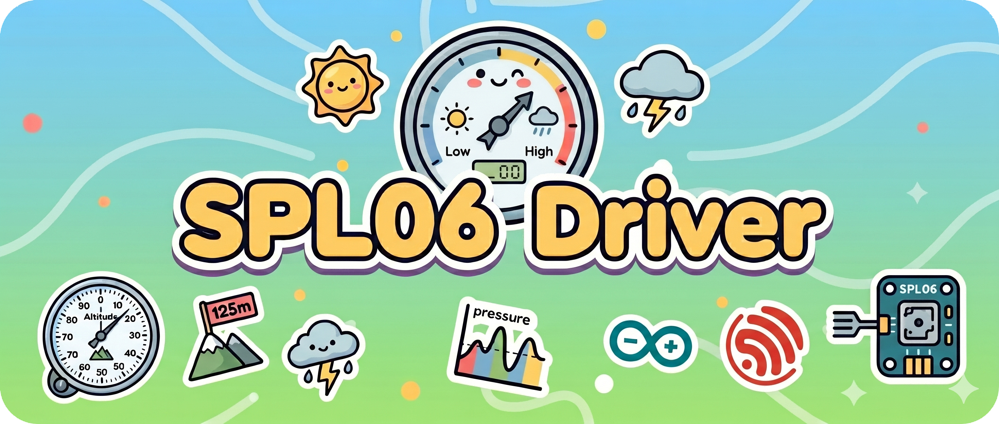

<p align="center">
  
</p>

<h1 align="center">🌡️ SPL06 Driver</h1>

<p align="center">
An SPL06 pressure and temperature sensor component for ESP-IDF<br/>
Built with the new I2C driver, standard compensation flow, and a low-coupling API design
</p>

<p align="center">
<a href="./README.md">简体中文</a>
· English
· <a href="https://github.com/NingZiXi/spl06/releases">Releases</a>
· <a href="https://github.com/NingZiXi/spl06/issues">Issues</a>
</p>

<p align="center">
  <a href="./LICENSE">
    
  </a>
  <a href="https://docs.espressif.com/projects/esp-idf/">
    
  </a>
  <a href="https://www.espressif.com/">
    
  </a>
  <a href="./idf_component.yml">
    
  </a>
  <a href="https://github.com/NingZiXi/spl06/stargazers">
    
  </a>
</p>

---

## 📌 Overview

This component targets `ESP-IDF 5.5.1+` and uses the new `driver/i2c_master.h` API. It supports both `0x76` and `0x77` addresses, implements standard SPL06 calibration parsing, compensated temperature and pressure calculation, and altitude estimation. The design keeps I2C bus ownership in the application layer while the component manages the SPL06 device handle, making it suitable for reuse in release projects.

## 🛠️ Quick Start

### 1. Get The Component

After publishing to the component registry:

```bash
idf.py add-dependency "ningzixi/spl06^0.1.0"
```

Or clone it into your project's `components` directory:

```bash
git clone https://github.com/NingZiXi/spl06.git
```

### 2. Basic Usage

```c
#include "driver/i2c_master.h"
#include "esp_log.h"
#include "spl06.h"

#define EXAMPLE_I2C_SDA  GPIO_NUM_4
#define EXAMPLE_I2C_SCL  GPIO_NUM_5
#define EXAMPLE_I2C_PORT I2C_NUM_0
#define EXAMPLE_I2C_FREQ 100000

static i2c_master_bus_handle_t bus_handle;
static spl06_t spl06;
static const char *TAG = "spl06";

static void init_i2c(void)
{
    const i2c_master_bus_config_t bus_cfg = {
        .i2c_port = EXAMPLE_I2C_PORT,
        .sda_io_num = EXAMPLE_I2C_SDA,
        .scl_io_num = EXAMPLE_I2C_SCL,
        .clk_source = I2C_CLK_SRC_DEFAULT,
        .glitch_ignore_cnt = 7,
        .flags.enable_internal_pullup = true,
    };

    ESP_ERROR_CHECK(i2c_new_master_bus(&bus_cfg, &bus_handle));
}

void app_main(void)
{
    spl06_config_t cfg;
    float temperature_c = 0.0f;
    float pressure_pa = 0.0f;
    float altitude_m = 0.0f;

    init_i2c();

    spl06_init_default_config(&cfg);
    cfg.i2c_address = SPL06_I2C_ADDRESS_HIGH;
    cfg.scl_speed_hz = EXAMPLE_I2C_FREQ;

    ESP_ERROR_CHECK(spl06_init(&spl06, bus_handle, &cfg));

    while (true) {
        if (spl06_read_temperature_pressure(&spl06, &temperature_c, &pressure_pa) == ESP_OK) {
            altitude_m = spl06_calculate_altitude(pressure_pa, SPL06_SEA_LEVEL_PA_DEFAULT);
            ESP_LOGI(TAG, "Temperature: %.2f C, Pressure: %.2f Pa, Altitude: %.2f m",
                     temperature_c, pressure_pa, altitude_m);
        }

        vTaskDelay(pdMS_TO_TICKS(1000));
    }
}
```

### 3. Example Output

```text
I (1234) spl06: Temperature: 31.76 C, Pressure: 100814.94 Pa, Altitude: 42.55 m
```

See `include/spl06.h` for the full API.

## 📚 Main APIs

- `spl06_init_default_config()`
- `spl06_init()`
- `spl06_deinit()`
- `spl06_read_temperature()`
- `spl06_read_pressure()`
- `spl06_read_temperature_pressure()`
- `spl06_calculate_altitude()`

## ⚙️ Default Configuration

- Address: `0x76`
- Timeout: `100 ms`
- Mode: continuous pressure and temperature
- Pressure: `4 Hz`, `16x`
- Temperature: `4 Hz`, `2x`
- Temperature source: external sensor

## 📝 Notes

- The component validates `chip id = 0x10`
- The application is responsible for creating and managing the I2C bus
- If your module uses `0x77`, set `SPL06_I2C_ADDRESS_HIGH`

## 📄 License

This project is licensed under the MIT License. See [LICENSE](./LICENSE) for details.
